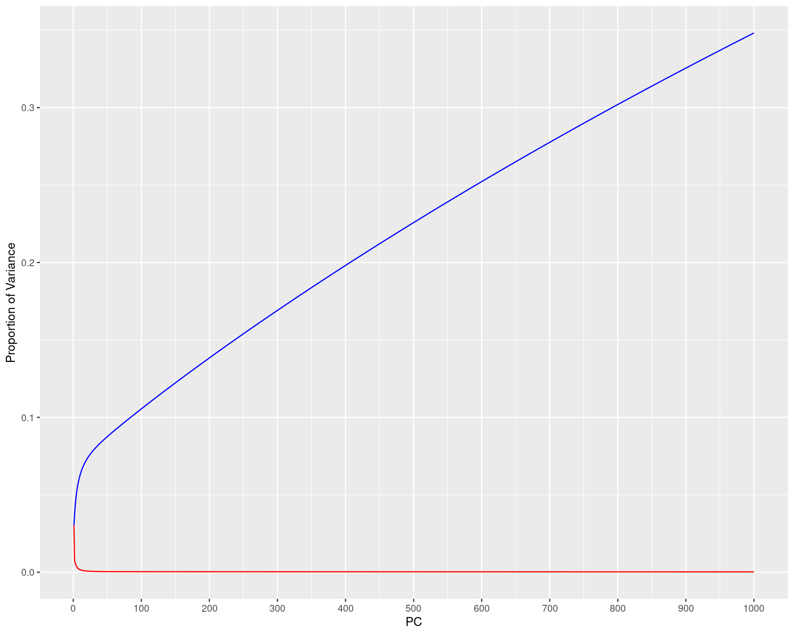
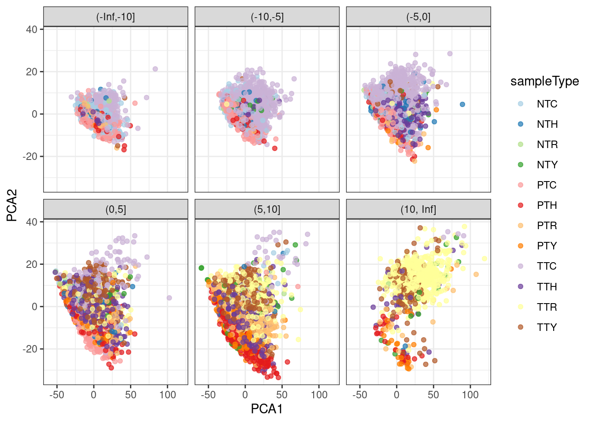

As a baseline we ran PCA on the data. The study from which we pulled our data ran PCA after 
downselecting to the top 1500 genes based on variance. However (after a log transform), the 
top 1500 genes only capture 30.6% of the total variance. We used the `irlba` package to 
avoid downselecting prior to PCA. The top 1000 PCs generated after the log transform and 
scaling captured 35% of the total variance. The top 30 transformed and scaled PCs captured 
7.9% of the total variance. 

```{r eval=FALSE}
library(SummarizedExperiment)

se <- readRDS("data/processed_data/se.rds")
```

```{r eval=FALSE}
library(irlba)
pca <- prcomp_irlba(log(1+t(assay(se))), n=30, scale=TRUE)

summary(pca)

## Importance of components:
##                             PC1     PC2     PC3     PC4     PC5     PC6     PC7
## Standard deviation     19.39456 9.46446 8.57641 7.40164 6.80212 5.94677 5.68891
## Proportion of Variance  0.03033 0.00722 0.00593 0.00442 0.00373 0.00285 0.00261
## Cumulative Proportion   0.03033 0.03755 0.04348 0.04790 0.05163 0.05448 0.05709
##                            PC8     PC9    PC10    PC11    PC12    PC13    PC14
## Standard deviation     4.99099 4.81352 4.46960 4.26250 4.13678 4.03639 3.53053
## Proportion of Variance 0.00201 0.00187 0.00161 0.00146 0.00138 0.00131 0.00101
## Cumulative Proportion  0.05910 0.06097 0.06258 0.06405 0.06542 0.06674 0.06774
##                           PC15    PC16    PC17    PC18    PC19    PC20    PC21
## Standard deviation     3.47232 3.46728 3.30243 3.17477 3.15645 3.06304 2.97921
## Proportion of Variance 0.00097 0.00097 0.00088 0.00081 0.00080 0.00076 0.00072
## Cumulative Proportion  0.06872 0.06969 0.07056 0.07138 0.07218 0.07294 0.07365
##                           PC22    PC23    PC24    PC25    PC26    PC27    PC28
## Standard deviation     2.91509 2.85166 2.79495 2.73282 2.64548 2.61816 2.59682
## Proportion of Variance 0.00069 0.00066 0.00063 0.00060 0.00056 0.00055 0.00054
## Cumulative Proportion  0.07434 0.07499 0.07562 0.07623 0.07679 0.07734 0.07789
##                           PC29    PC30
## Standard deviation     2.57347 2.51443
## Proportion of Variance 0.00053 0.00051
## Cumulative Proportion  0.07842 0.07893
```

The next plot shows the proportion and cumulative proportion of variance 
for the first 1000 PCs.

```{r eval=FALSE}
pca_var = as.data.frame(pca$sdev)
colnames(pca_var) <- c("sdev")

ggplot(aes(x=1:length(sdev),y=sdev^2/pca$totalvar),data=pca_var) + 
	geom_line(color="red") + 
	geom_line(aes(y=cumsum(sdev^2)/pca$totalvar),color="blue") +
	labs(x="PC",y="Proportion of Variance") +
	scale_x_continuous(breaks=c(0,100,200,300,400,500,600,700,800,900,1000))
```



After the first 30 or so PCs, the slope of the cumulative proportion of variance 
becomes nearly constant. This means that the principal components have nearly the 
same variances and correspond to nearly the same eigenvalues. Therefore they are 
extremely unstable and small perturbations on the data could lead to large changes 
in the principal components past 30.

We pull the first three principal components for further analysis.

```{r eval=FALSE}
metadata <- as.data.frame(colData(se))

metadata["PCA1"] = pca$x[,1]
metadata["PCA2"] = pca$x[,2]
metadata["PCA3"] = pca$x[,3]
metadata["PCA3_cat"] = cut(pca$x[,3], breaks=c(-Inf, -10, -5, 0, 5, 10, Inf))
```

The following plot shows the first three principal components. The x and y 
axes show the first two PCs and the faceting shows the third PC. These 
principal components capture 4.3% of the total variance after the log 
transform and scaling.

```{r eval=FALSE}

library(ggplot2)

ggplot(aes(x=PCA1,y=PCA2,color=sampleType),data=metadata) + 
        geom_point(alpha=0.7) +
        facet_wrap(~PCA3_cat) + 
        scale_color_brewer(palette="Paired") + 
        theme_bw()
```



Although the clusters are not well separated in this plot, at least the elements 
from the same sample type appear together.

