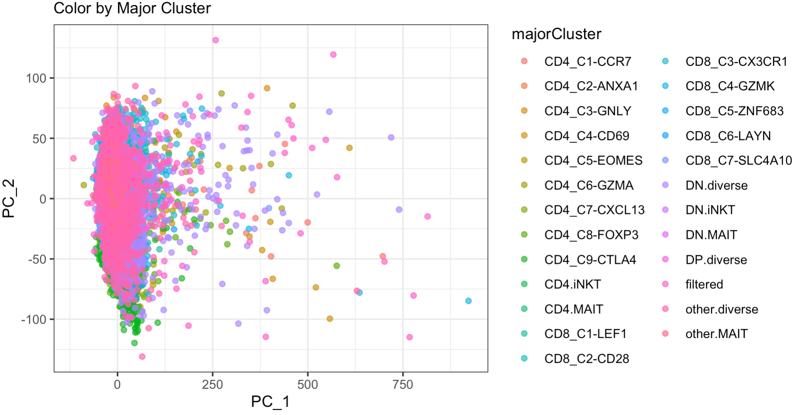

## Background

[@Guo2018] studied the complexity of tumor-infiltrating T cells in NSCLC, and performed single-cell RNA-seq on T cells derived from tumor, adjacent normal tissues and peripheral blood for 14 treatment-naïve patients, including 11 adenocarcinomas and three squamous cell carcinomas. After confirming the existence of T cell infiltration in NSCLC tumors, they sorted various T cell subtypes based on cell surface markers CD3/CD4/CD8/CD25 by fluorescence-activated cell sorting (FACS). A total of 12,346 cells were sequenced at an average depth of 1.04 million uniquely-mapped read pairs per cell.
The aim of [@Guo2018] was to broadly characterize the "T cell landscape" of patients with lung cancer.
The data collection process is shown graphically below.

![Figure adapted from [@Guo2018]](Figures/lab.PNG)

[@Guo2018] employed the following strategy for analyzing the sequenced T-cells:
First, cells with greater than 10% mitochondrial gene expression or TPM less than 10
for CD3D, CD3E, and CD3G were removed. Next, genes with mean count less than 1
were filtered. After filtering, 'sum factors' were computed and the data was log2
transformed. The normalized expression matrix was then mean centered *within patient*.
For clustering, the authors filtered the expression matrix to the top 1500
highest variance genes and performed PCA of with the first 30 principal components
were used for t-SNE. The authors then use the 2D embedding to create clusters.
They then used the 1000 most significantly differentially expressed genes
between the clusters identified by ANOVA as input into t-SNE and cluster calling
a second time. These clusters and representative genes are shown in the figure below.

![Figure adapted from [@Guo2018]](Figures/T cells.PNG)

## Hypothesis

It has been previously written that the t-SNE embedding can distort true relationships
or identify relationships where none exist, especially after transformation[@Chari2021],[@Townes2019].
Given this fact, and the multiplicity of testing performed by the authors, it is
unlikely that the proposed clusters represent true biological phenomenon.
We hypothesized that it is much more likely that the true clustering is related
to one of the following known biological factors:

1) Tissue source, since T-cells were extracted from the tumor, adjacent normal,
and peripheral blood.

2) Patient, since one would expect heterogeneity in expression amongst the 14
patients

3) The FACS sorted T-cell labels, since these correspond to known subtypes
of T-cells.

## PCA

```{r child = "PCA.Rmd"}
```


## GLM-PCA

Besides the standard PCA method, we implemented the GLM-PCA (PCA for generalized linear models) method [@Townes2019]. To compare, the standard PCA minimizes the mean squared error (MSE) between the data and a low-rank representation (also called embedding), which is equivalent to minimizing the Euclidean distance between the embedding and the data. Essentially, the standard PCA is equivalent to maximizing the likelihood of a Gaussian model. In contrast, the GLM-PCA minimizes a generalization of the MSE: the deviance, and hence allows for a wide variety of likelihoods suitable for data types like count and binary data. The advantage of the GLM-PCA method over the standard PCA is that the GLM-PCA is more concordant to the data-generating mechanism. In other words, the analysis can be done using the raw data without any sequential normalization and transformation. 
 
We filtered out the genes with mean count less than or equal to 1 (12402 genes left after filtering) and then applied the GLM-PCA method. Since the data type is count, we implemented the GLM-PCA based on two different likelihoods: the negative binomial likelihood (to account for over-dispersion) and the Poisson likelihood, via the `glmpca` package. As in the analysis with the standard PCA, we chose the number of latent dimensions to be 30. 

For each model, we plotted the first two latent dimensions colored by sample types, tissues, patients, and the major clusters identified in the original data paper [@Guo2018].

```{r, eval=FALSE}
library(dplyr)

# load the data
source("src/get_data.R")
rm(d, info, zeros)

count <- as.matrix(assay(se))
count <- as.matrix(count)
metadata <- as.data.frame(colData(se))
colnames(count) <- metadata$UniqueCell_ID
rownames(count) <- rowData(se)$geneID

# function to get the tissue from sample type 
metadata$Tissue <- sapply(metadata$sampleType, function(x){
  if (x %in% c("NTC", "NTH", "NTR")) {
    return("Adjacent Normal Lung Tissues")
  } else if (x %in% c("PTC", "PTH", "PTR", "PTY")) {
    return("Peripheral Blood")
  } else{
    return("Tumor")
  }
})
```


### Based on Negative Binomial Likelihood 

The following plots are based on the negative binomial model.

```{r, eval=FALSE}
library(glmpca)
library(ggplot2)
library(NatParksPalettes)
library(gridExtra)

# GLM-PCA based on negative binomial likelihood 
res_pc30 <- glmpca(count, 30, fam = "nb")

factors <- res_pc30$factors
metadata["PC_1"] = factors[,1]
metadata["PC_2"] = factors[,2]

# color by sample type and tissue
p1 = ggplot(aes(x=PC_1,y=PC_2,color=sampleType),data=metadata) + 
  geom_point(alpha=0.7) +
  labs(subtitle = "Color by Sample Type") + 
  scale_color_brewer(palette="Paired") + 
  theme_bw()
p2 = ggplot(aes(x=PC_1,y=PC_2,color=Tissue),data=metadata) + 
  geom_point(alpha=0.7) +
  labs(subtitle = "Color by Tissue") +
  scale_color_brewer(palette="Paired") + 
  theme_bw() +
  theme(legend.position = "bottom")

grid.arrange(p1, p2, ncol = 2)
```

```{r, echo=FALSE}
knitr::include_graphics("Figures/glmpca_nb_sampletype.png")
```

From the plots above, we can see that there are no distinct patterns in the plot colored by sample type. In the plot colored by tissue type, the tumor samples seem to be slightly different from the other two types of samples, but the separations among different clusters are not obvious.

The plot colored by patient (shown below) also indicates that the samples from different patients can not be well separated. 

```{r, eval=FALSE}
# color by patient
ggplot(aes(x=PC_1,y=PC_2,color=Patient),data=metadata) + 
  geom_point(alpha=0.7) +
  labs(subtitle = "Color by Patient") +
  theme_bw() 
```

```{r, echo=FALSE, out.width = '60%'}
knitr::include_graphics("Figures/glmpca_nb_patient.png")
```


In addition, we colored the plot (shown below) by the major clusters found in the original data paper [@Guo2018]. Unlike in the original paper (the t-SNE plot in the Background section), the clusters in the plot are not well separated, but it was not very surprising since here we only applied a naive filter: restricted the data to the genes with mean count greater than 1. It is possible that many genes that do not contribute to clustering (T cell subtype identification) still remain in the data. 

```{r, eval=FALSE}
# color by major cluster
ggplot(aes(x=PC_1,y=PC_2,color=majorCluster),data=metadata) + 
  geom_point(alpha=0.7) +
  labs(subtitle = "Color by Major Cluster") +
  theme_bw()
```

```{r, echo=FALSE, out.width = '80%'}
knitr::include_graphics("Figures/glmpca_nb_majorcluster.png")
```


### Based on Poisson Likelihood 

The following plots are based on the Poisson model. We can obtain similar conclusions as from the plots based on the negative binomial model. That is, we cannot find distinct clustering patterns regardless of colored by sample types, tissues, patients, or the major clusters. 

```{r, eval=FALSE}
# GLM-PCA based on Poisson likelihood 
res2_pc30 <- glmpca(count, 30, fam = "poi")
metadata2 = subset(metadata, select = c(UniqueCell_ID, Patient, majorCluster, sampleType, Tissue))
factors2 <- res2_pc30$factors
metadata2["PC_1"] = factors2[,1]
metadata2["PC_2"] = factors2[,2]

# color by sample type and tissue
p1 = ggplot(aes(x=PC_1,y=PC_2,color=sampleType),data=metadata2) + 
  geom_point(alpha=0.7) +
  labs(subtitle = "Color by Sample Type") + 
  scale_color_brewer(palette="Paired") + 
  theme_bw()
p2 = ggplot(aes(x=PC_1,y=PC_2,color=Tissue),data=metadata2) + 
  geom_point(alpha=0.7) +
  labs(subtitle = "Color by Tissue") +
  scale_color_brewer(palette="Paired") + 
  theme_bw() +
  theme(legend.position = "bottom")

grid.arrange(p1, p2, ncol = 2)
```

```{r, echo=FALSE}
knitr::include_graphics("Figures/glmpca_poi_sampletype.png")
```


```{r, eval=FALSE}
# color by patient
ggplot(aes(x=PC_1,y=PC_2,color=Patient),data=metadata2) + 
  geom_point(alpha=0.7) +
  labs(subtitle = "Color by Patient") +
  theme_bw() 
```

```{r, echo=FALSE, out.width = '60%'}
knitr::include_graphics("Figures/glmpca_poi_patient.png")
```


```{r, eval=FALSE}
# color by major cluster
ggplot(aes(x=PC_1,y=PC_2,color=majorCluster),data=metadata2) + 
  geom_point(alpha=0.7) +
  labs(subtitle = "Color by Major Cluster") +
  theme_bw()
```

```{r, echo=FALSE, out.width = '80%'}

```


## Gaussian Mixture Modeling

As an alternative to t-SNE, we fit Gaussian mixture models (GMM) using `mclust/v6.0.0` [@mclust6].
Similar to [@Guo2018], we used the first 30 PCs of the log2 tranformed expression,
however, we included all genes with mean count greater than 1, instead of the most
variable 1500. The choice of 30 PCs was out of convenience, since attempting to fit a
GMM for a ~12000 X 12000 matrix was infeasible. However, for the purpose of
examining how results change given clustering strategy, this is sufficient.

```{r, eval=F}
library(irlba)
library(mclust)
library(SummarizedExperiment)
library(tidyverse)
se <- readRDS("data/processed_data/se.rds")
express <- log2(t(assay(se)) + 1)
pc_express <- prcomp_irlba(express, n = 30, scale = T)

## 4 models
## G = 3, each tissue site
## G = 14 patients
## G = 12 Cell types
## G = 16 Publication
gmm <- Mclust(pc_express$x, G = c(3,12,14,16))
```

To evaluate the fit of each GMM, we use Bayesian Information Criterion (BIC) as a simple
metric for choosing the best model. From the left figure below, we see the BIC
peaks at 14 components.

```{r, eval=F}
gmm_bic <- gmm$BIC[,"VEV"] %>% as.data.frame()
colnames(gmm_bic) <- c("BIC")

## BIC plot of 4 model fits
gmm_bic %>% rownames_to_column("Components") %>%
  ggplot(aes(x = as.numeric(Components), y = BIC)) +
  geom_point() +
  geom_line() +
  labs(x = "Components") +
  theme_bw()
se$PC1 <- pc_express$x[,1]
se$PC2 <- pc_express$x[,2]

## Right plot, GMM clusters
ggplot(as.data.frame(colData(se)), aes(x = PC1, y = PC2, color = as.factor(gmm_cluster))) +
  geom_point(alpha = 0.5) +
  stat_ellipse() +
  scale_color_discrete(name = "GMM Cluster") +
  theme_bw()
```

```{r, fig.show="hold", out.width="50%", echo=F}


```

In the two plots below, we overlay the known patient and sample type (T-cell type)
with the GMM clusters. While there is no distinct separation, the clusters
in the lower half of the plot appear to be tumor derived T-cells (TTC, TTH, TTR, TTY), while the clusters
in the top half appear to be more related to peripheral blood derived T-cells (PTC, PTH, PTR, PTY).
The normal derived T-cells appear to be randomly distributed throughout the clusters (NTC, NTH, NTR, NTY).

```{r, eval=F}
## Right, GMM clusters colored by T-cell tissue source
ggplot(as.data.frame(colData(se)), aes(x = PC1, y = PC2)) +
  geom_point(alpha = 0.5, aes(color = sampleType)) +
  stat_ellipse(aes(group = as.factor(gmm_cluster))) +
  scale_color_discrete(name = "Sample Type") +
  theme_bw()

## Left, GMM clusters colored by Patient 
ggplot(as.data.frame(colData(se)), aes(x = PC1, y = PC2)) +
  geom_point(alpha = 0.5, aes(color = Patient)) +
  stat_ellipse(aes(group = as.factor(gmm_cluster))) +
  scale_color_discrete(name = "Patient") +
  theme_bw()
```

```{r, fig.show="hold", out.width="50%", echo=F}


```

## Conclusions

In this analysis, we used three different strategies for exploring single cell
RNAseq from T-cells derived from 14 lung cancer patients. The goal of exploring
the data in this way was to determine if using techniques that, at least in principle,
are more interpretable than t-SNE, we could learn something about the underlying
T-cell biology. Interestingly, despite using very similar filtering and transformations
to the expression data, we did not observe the same amount of cluster separation
that the original authors saw. Even GLM-PCA, which should in theory be a better
fit for the data, did not convincingly produce any structure in the 2D embedding.
Our GMM results show the data could be consistent with any where from 12-16 clusters,
with a high degree of overlap between them. Given these results, there seems
to be more homogeneity of the T-cells than [@Guo2018] suggests.
This could also suggest that a discrete clustering based approach is not appropriate
for this data and some continuous measure of T-cell state would better describe
the data.

## References


