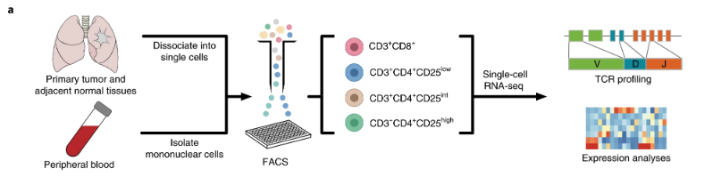
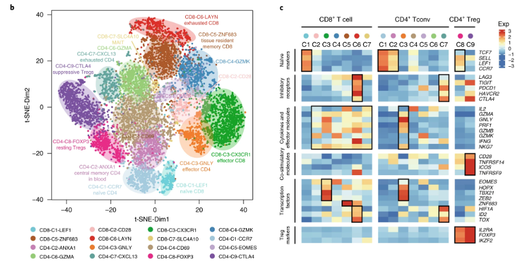

## Background


Lung cancer is one of the most commonly diagnosed cancers and the leading cause of cancer death. For many years, the main treatments for lung cancer include surgery, chemotherapy, radiotherapy and targeted therapy. Non-small-cell lung cancer (NSCLC) is the leading cause of cancer-related mortality and accounts for ~85$\%$ of lung cancers. NSCLC tumors typically harbor extensive genomic alterations, with high mutation load linking to better response to checkpoint blockade although with exceptions. 

The paper [-@Guo2018] studied the complexity of tumor-infiltrating T cells in NSCLC, and performed deep single-cell RNA sequencing on T cells isolated from tumor, adjacent normal tissues and peripheral blood for 14 treatment-naïve patients, including 11 adenocarcinomas and three squamous cell carcinomas. After confirming the existence of T cell infiltration in NSCLC tumors, they sorted various T cell subtypes based on cell surface markers CD3/CD4/CD8/CD25 by fluorescence-activated cell sorting (FACS). A total of 12,346 cells were sequenced at an average depth of 1.04 million uniquely-mapped read pairs per cell, enabling reliable detection of lowly expressed cytokines and transcription factors.

    


## PCA VS t-SNE in dimensional reduction analysis

The number of input variables or features for a dataset is referred to as its dimensionality. Dimensionality reduction refers to techniques that reduce the number of input variables in a dataset. More input features often make a predictive modeling task more challenging to model, more generally referred to as the curse of dimensionality. In biology statistics, high-dimensionality statistics and dimensionality reduction techniques are often used for data visualization. Nevertheless these techniques can be used in applied machine learning to simplify a classification or regression dataset in order to better fit a predictive model. Dimensionality reduction is a data preparation technique performed on data prior to modeling. It might be performed after data cleaning and data scaling and before training a predictive model.


### Principal Component analysis (PCA): 
PCA is an unsupervised linear dimensionality reduction and one of most important data visualization technique for high dimensional data. The main idea behind this technique is to reduce the dimensionality of data that is highly correlated by transforming the original set of vectors to a new set.It is also known as matrix factorization methods, which reduce a dataset matrix into its constituent parts. Examples include the eigendecomposition and singular value decomposition. The parts can be ranked and subsets of the parts can be selected that best capture the salient structure and can be used to represent the dataset.   

### t-distributed stochastic neighbourhood embedding (t-SNE): 
t-distributed stochastic neighbor embedding (t-SNE) is a statistical method for visualizing high-dimensional data by giving each datapoint a location in a two or three-dimensional map. It is based on Stochastic Neighbor Embedding originally developed by Sam Roweis and Geoffrey Hinton,[1] where Laurens van der Maaten proposed the t-distributed variant.[2] It is a nonlinear dimensionality reduction technique well-suited for embedding high-dimensional data for visualization in a low-dimensional space of two or three dimensions. Specifically, it models each high-dimensional object by a two- or three-dimensional point in such a way that similar objects are modeled by nearby points and dissimilar objects are modeled by distant points with high probability.

The t-SNE algorithm comprises two main stages. First, t-SNE constructs a probability distribution over pairs of high-dimensional objects in such a way that similar objects are assigned a higher probability while dissimilar points are assigned a lower probability. Second, t-SNE defines a similar probability distribution over the points in the low-dimensional map, and it minimizes the Kullback–Leibler divergence (KL divergence) between the two distributions with respect to the locations of the points in the map. While the original algorithm uses the Euclidean distance between objects as the base of its similarity metric, this can be changed as appropriate.

Given a set of ${\displaystyle N}$ high-dimensional objects ${\displaystyle \mathbf {x} _{1},\dots ,\mathbf {x} _{N}}$,t-SNE first computes probabilities ${\displaystyle p_{ij}}$ that are proportional to the similarity of objects $\mathbf {x} _{i}$ and $\mathbf {x} _{j}$, as follows. 
\begin{align}
    p_{i|j} &= \frac{ exp (-\lVert x_i - x_j \rVert^2/2\sigma_i^2)}{\sum_{k \neq i} exp (-\lVert x_i - x_k \rVert^2/2\sigma_i^2)}\\
    p_{i|i} &= 0
    \label{}
\end{align}
Let define $p_{ij} = \frac{p_{i|j} + p_{j|i}}{2N}$, and note that $p_{ij} = p_{ji}, \sum p_{ij} = 1$. The locations of the points $\mathbf {x} _{i}$ in the map are determined by minimizing the (non-symmetric) Kullback–Leibler divergence of the distribution P from the distribution Q, that is:
\begin{align}
    KL (P \rVert Q) &= \sum_{i \neq j} p_{ij} log \frac{p_{ij}}{q_{ij}}
    \label{}
\end{align}
The minimization of the Kullback–Leibler divergence with respect to the points $\mathbf {y} _{i}$ is performed using gradient descent. The result of this optimization is a map that reflects the similarities between the high-dimensional inputs.


There is no best technique for dimensionality reduction. Instead, the best approach is to use systematic controlled experiments to discover what dimensionality reduction techniques, when paired with the model of choice, result in the best performance on the dataset. Typically, linear algebra and manifold learning methods assume that all input features have the same scale or distribution. This suggests that it is good practice to either normalize or standardize data prior to using these methods if the input variables have differing scales or units. In the paper, dimensional reduction analysis (t-SNE) was applied to the expression data revealed that T cells clustered primarily based on their tissue origins and subtypes. 


The t-SNE projection of 9,055 single T cells from 14 patients, showing the formation of 16 main clusters, including 7 for CD8+ T cells, 7 for conventional CD4+ T cells (Tconvs; C1, C2, C3, C4, C5, C6 and C7 of CD4 clusters) and 2 for regulatory T cells (Tregs; C8 and C9 of CD4 clusters). Each dot corresponds to one single cell, colored according to cell cluster. c, z-score normalized mean expression of selected T cell function-associated genes in each cell cluster. Black boxes highlight the prominent patterns defining known T cell subtypes.

## Hypothesis


## PCA

```{r child = "PCA.Rmd"}
```


## GLM-PCA

Besides the standard PCA method, we implemented the GLM-PCA (PCA for generalized linear models) method [-@Townes2019]. To compare, the standard PCA minimizes the mean squared error (MSE) between the data and a low-rank representation (also called embedding), which is equivalent to minimizing the Euclidean distance between the embedding and the data. Essentially, the standard PCA is equivalent to maximizing the likelihood of a Gaussian model. In contrast, the GLM-PCA minimizes a generalization of the MSE: the deviance, and hence allows for a wide variety of likelihoods suitable for data types like count and binary data. The advantage of the GLM-PCA method over the standard PCA is that the GLM-PCA is more concordant to the data-generating mechanism. In other words, the analysis can be done using the raw data without any sequential normalization and transformation. 
 
We filtered out the genes with mean count less than or equal to 1 (12402 genes left after filtering) and then applied the GLM-PCA method. Since the data type is count, we implemented the GLM-PCA based on two different likelihoods: the negative binomial likelihood (to account for over-dispersion) and the Poisson likelihood, via the `glmpca` package. As in the analysis with the standard PCA, we chose the number of latent dimensions to be 30. 

For each model, we plotted the first two latent dimensions colored by sample types, tissues, patients, and the major clusters identified in the original data paper [-@Guo2018].

```{r, eval=FALSE}
library(dplyr)

# load the data
source("src/get_data.R")
rm(d, info, zeros)

count <- as.matrix(assay(se))
count <- as.matrix(count)
metadata <- as.data.frame(colData(se))
colnames(count) <- metadata$UniqueCell_ID
rownames(count) <- rowData(se)$geneID

# function to get the tissue from sample type 
metadata$Tissue <- sapply(metadata$sampleType, function(x){
  if (x %in% c("NTC", "NTH", "NTR")) {
    return("Adjacent Normal Lung Tissues")
  } else if (x %in% c("PTC", "PTH", "PTR", "PTY")) {
    return("Peripheral Blood")
  } else{
    return("Tumor")
  }
})
```


### Based on Negative Binomial Likelihood 

The following plots are based on the negative binomial model.

```{r, eval=FALSE}
library(glmpca)
library(ggplot2)
library(NatParksPalettes)
library(gridExtra)

# GLM-PCA based on negative binomial likelihood 
res_pc30 <- glmpca(count, 30, fam = "nb")

factors <- res_pc30$factors
metadata["PC_1"] = factors[,1]
metadata["PC_2"] = factors[,2]

# color by sample type and tissue
p1 = ggplot(aes(x=PC_1,y=PC_2,color=sampleType),data=metadata) + 
  geom_point(alpha=0.7) +
  labs(subtitle = "Color by Sample Type") + 
  scale_color_brewer(palette="Paired") + 
  theme_bw()
p2 = ggplot(aes(x=PC_1,y=PC_2,color=Tissue),data=metadata) + 
  geom_point(alpha=0.7) +
  labs(subtitle = "Color by Tissue") +
  scale_color_brewer(palette="Paired") + 
  theme_bw() +
  theme(legend.position = "bottom")

grid.arrange(p1, p2, ncol = 2)
```

```{r, echo=FALSE}

```

From the plots above, we can see that there are no distinct patterns in the plot colored by sample type. In the plot colored by tissue type, the tumor samples seem to be slightly different from the other two types of samples, but the separations among different clusters are not obvious.

The plot colored by patient (shown below) also indicates that the samples from different patients can not be well separated. 

```{r, eval=FALSE}
# color by patient
ggplot(aes(x=PC_1,y=PC_2,color=Patient),data=metadata) + 
  geom_point(alpha=0.7) +
  labs(subtitle = "Color by Patient") +
  theme_bw() 
```

```{r, echo=FALSE, out.width = '60%'}

```


In addition, we colored the plot (shown below) by the major clusters found in the original data paper [-@Guo2018]. Unlike in the original paper (the t-SNE plot in the Background section), the clusters in the plot are not well separated, but it was not surprising since here we only applied a naive filter: restricted the data to the genes with mean count greater than 1. It is possible that many genes that do not contribute to clustering (T cell subtype identification) still remain in the data. 

```{r, eval=FALSE}
# color by major cluster
ggplot(aes(x=PC_1,y=PC_2,color=majorCluster),data=metadata) + 
  geom_point(alpha=0.7) +
  labs(subtitle = "Color by Major Cluster") +
  theme_bw()
```

```{r, echo=FALSE, out.width = '80%'}

```


### Based on Poisson Likelihood 

The following plots are based on the Poisson model. We can obtain similar conclusions as from the plots based on the negative binomial model. 

```{r, eval=FALSE}
# GLM-PCA based on Poisson likelihood 
res2_pc30 <- glmpca(count, 30, fam = "poi")
metadata2 = subset(metadata, select = c(UniqueCell_ID, Patient, majorCluster, sampleType, Tissue))
factors2 <- res2_pc30$factors
metadata2["PC_1"] = factors2[,1]
metadata2["PC_2"] = factors2[,2]

# color by sample type and tissue
p1 = ggplot(aes(x=PC_1,y=PC_2,color=sampleType),data=metadata) + 
  geom_point(alpha=0.7) +
  labs(subtitle = "Color by Sample Type") + 
  scale_color_brewer(palette="Paired") + 
  theme_bw()
p2 = ggplot(aes(x=PC_1,y=PC_2,color=Tissue),data=metadata) + 
  geom_point(alpha=0.7) +
  labs(subtitle = "Color by Tissue") +
  scale_color_brewer(palette="Paired") + 
  theme_bw() +
  theme(legend.position = "bottom")

grid.arrange(p1, p2, ncol = 2)
```

```{r, echo=FALSE}

```


```{r, eval=FALSE}
# color by patient
ggplot(aes(x=PC_1,y=PC_2,color=Patient),data=metadata2) + 
  geom_point(alpha=0.7) +
  labs(subtitle = "Color by Patient") +
  theme_bw() 
```

```{r, echo=FALSE, out.width = '60%'}

```


```{r, eval=FALSE}
# color by major cluster
ggplot(aes(x=PC_1,y=PC_2,color=majorCluster),data=metadata) + 
  geom_point(alpha=0.7) +
  labs(subtitle = "Color by Major Cluster") +
  theme_bw()
```

```{r, echo=FALSE, out.width = '80%'}
knitr::include_graphics("Figures/glmpca_poi_majorcluster.png")
```


## Gaussian Mixture Modeling


## Conclusions

## References

